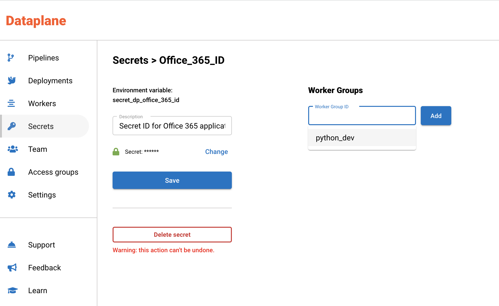

# Register an Azure app

To interact with Office 365 APIs, you need to register an Azure app in Azure Portal. Once an app is created, assign specific API permissions that you need.&#x20;

1. Login at [https://portal.azure.com](https://portal.azure.com)
2. Go to App registrations&#x20;

.png>)

3\. Create an app

4\. Create a secret


It is important to keep these credentials safe using a key store. It is good security practice not to hard code the secret in your code. You can use Dataplane's secrets to store these credentials.&#x20;

